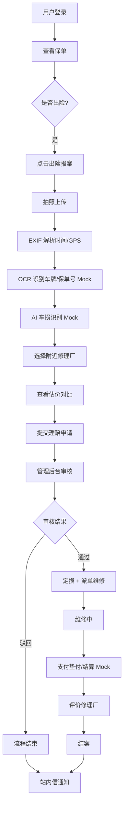
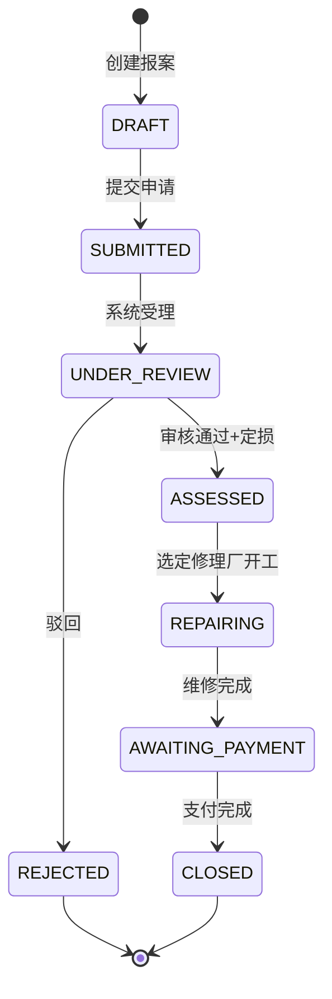

# 车险理赔 H5 · 项目计划（PLAN）

> Living document · 最后更新：2026-06-25
> 仓库：https://github.com/Guranta/carwork（public）
> 当前阶段：**M0 - 仓库初始化**

---

## 0. 项目元信息

| 项 | 值 |
|---|---|
| 项目名 | carwork（车险理赔 H5） |
| 定位 | 学习 / 毕业设计，代码清晰优先 |
| 部署目标 | Linux 服务器，Docker Compose 一键启动 |
| 用户角色 | 车主（H5）、理赔员（后台）、维修方（后台）、管理员（后台） |
| 核心闭环 | 查看保单 → 出险报案 → 拍照/AI识损 → 选修理厂 → 理赔审核 → 支付 → 评价 |

---

## 1. 技术栈

| 层 | 选型 | 备注 |
|---|---|---|
| 用户端 H5 | React 18 + Vite + TypeScript + TailwindCSS + Vant + Zustand + React Router | 锁定移动端 375px 基准 |
| 管理后台 | React 18 + Vite + TypeScript + TailwindCSS + Ant Design | 锁定 PC 端 |
| 后端 | NestJS 10 + TypeScript | 装饰器风格，模块化清晰 |
| ORM | Prisma | TypeScript 原生 |
| 数据库 | SQLite（开发）→ 可平滑迁移 PostgreSQL（生产） | 零运维 |
| 实时通知 | socket.io（WebSocket） | 站内信推送 |
| API 文档 | Swagger（@nestjs/swagger 自动生成） | 答辩友好 |
| 图片存储 | 本地 `server/uploads/` + Nginx 静态服务 | 不依赖云 OSS |
| 反向代理 | Nginx | 统一域名分发 |
| 部署 | Docker Compose | api + web-mobile + web-admin + nginx |

---

## 2. UI 设计系统（参考 raft.build）

### 2.1 视觉关键词

**Brutalist · Monochrome · Bold Typography · Pill Tags · Hard Edges**

### 2.2 设计 Token

```css
/* 颜色 */
--ink:        #0A0A0A;   /* 主文字 / 边框 */
--paper:      #FAFAF7;   /* 纸感背景（带一点暖度） */
--concrete:   #E8E8E3;   /* 次级背景 / 分隔 */
--muted:      #6B6B66;   /* 次要文字 */
--accent:     #FF5C28;   /* 强调色：出险 CTA、状态高亮 */
--success:    #1F8A4C;   /* 通过 / 已结案 */
--warn:       #E2B440;   /* 审核中 */
--danger:     #D14343;   /* 拒赔 / 驳回 */

/* 字体 */
--font-display: "Inter Display", "Geist", system-ui;  /* 标题 800 */
--font-sans:    "Inter", system-ui;                    /* 正文 400/500 */
--font-mono:    "JetBrains Mono", monospace;           /* 保单号 / 金额 / 坐标 */

/* 形状 */
--radius:      4px;        /* 接近直角的硬边 */
--border:      1.5px;      /* solid ink */
--shadow:      none;       /* 无投影，靠边框 + 留白分层 */
```

### 2.3 组件规范

- **Pill 标签**：4px 圆角 + 1px 边框 + 全大写 11px 字母 + 4px 8px 内边距
  - 角色徽章：`车主` `理赔员` `维修方` `管理员`（每种一色）
  - 状态徽章：`有效` `审核中` `已结案` `已驳回`
  - 资质徽章：`4S 店` `认证维修` `快修连锁`
- **Hero 区**：超大字号无衬线粗体（48-64px），行高 1.0，副标题灰色 14px
- **卡片**：白底 + 1.5px ink 边框 + 4px 圆角 + 无阴影 + 16-24px 内边距
- **CTA 按钮**：
  - 主 CTA：accent 色实心 + ink 文字 + 4px 圆角 + 大尺寸（高度 56px）
  - 次 CTA：paper 背景 + ink 边框
- **数字展示**：JetBrains Mono + 24-48px + 紧字距（用于保额、估价、坐标）

### 2.4 页面气质指导

- 大量留白，避免信息密度过高
- 用粗边框分割区块，不用阴影/渐变
- 团队卡片样式应用到修理厂列表（Logo + 名称 + 资质 Pill + 签名 + 评分）
- 引用块用粗黑左边框 + 大字号（用户评价、文案金句）
- 不用花哨图标，用极简线条 SVG 或字符符号

---

## 3. 功能模块

### 3.1 用户端 H5（9 页）

| # | 页面 | 核心元素 |
|---|---|---|
| 1 | 登录页 | 手机号 + 验证码（Mock 固定 1234）+ 大 Logo |
| 2 | 首页 / 我的保单 | Hero（用户名 + 大保额数字 + `有效` Pill）+ 保单卡片列表 + 底部固定 `出险报案` CTA |
| 3 | 出险报案 - 拍照 | 大取景 / 上传组件（最多 9 张）+ 每张 EXIF 时间/GPS 角标 + AI 识别结果 Pill |
| 4 | 出险报案 - 信息确认 | OCR 返回的车牌/保单号（mono 字体，可编辑）+ 估损明细卡片 + 估损总计大数字 |
| 5 | 附近修理厂 | 纯 CSS 模拟地图（栅格 + 散布点）+ 修理厂卡片列表 + 排序 Pill（距离/价格/评分） |
| 6 | 理赔进度跟踪 | 垂直时间线 + 状态 Pill 节点（报案 → 审核中 → 已定损 → 维修中 → 待支付 → 已结案） |
| 7 | 站内信 | 消息列表 + 未读 accent 圆点 |
| 8 | 支付页（Mock） | 大金额数字 + `垫付`/`自付` Pill + `模拟支付` 大 CTA |
| 9 | 我的 | 头像 + 角色 Pill + 车辆信息 + 评价入口 |

### 3.2 管理后台 PC（6 页）

| # | 页面 | 核心元素 |
|---|---|---|
| 1 | Dashboard 看板 | KPI 大数字（今日报案/待审核/本月结案/赔付总额）+ 趋势图 |
| 2 | 理赔审核工作台 | 待审列表 + 详情抽屉 + 审核操作（通过/驳回/派单） |
| 3 | 修理厂管理 | CRUD + 资质审核 + 评分统计 |
| 4 | 保单管理 | CRUD + 用户关联 |
| 5 | 用户管理 | 列表 + 详情 + 状态控制 |
| 6 | 消息发送 | 群发站内信 + 通知模板 |

---

## 4. 业务流程

### 4.1 出险报案全链路



### 4.2 理赔单状态机



---

## 5. 数据模型

### 5.1 主要表（共 10 张）

| 表 | 关键字段 | 说明 |
|---|---|---|
| `User` | id, phone, name, avatar, role, createdAt | 车主（role=OWNER） |
| `Vehicle` | id, ownerId, plateNo, brand, model, vin | 车辆信息 |
| `Policy` | id, policyNo, ownerId, vehicleId, type, startDate, endDate, coverageAmount, status | 保单 |
| `Claim` | id, claimNo, policyId, ownerId, shopId, status, incidentTime, incidentLat, incidentLng, description, assessmentAmount, finalAmount | 理赔单 |
| `ClaimImage` | id, claimId, url, type, exifTime, exifLat, exifLng | 理赔照片 |
| `DamageReport` | id, claimId, parts(JSON), totalEstimate, aiRawResponse | AI 车损识别结果 |
| `RepairShop` | id, name, logo, lat, lng, certification, rating, reviewCount, basePrice | 修理厂 |
| `Notification` | id, userId, type, title, body, isRead, createdAt | 站内信 |
| `Payment` | id, claimId, mockOrderNo, amount, type(ADVANCE/SELF), status, paidAt | 支付记录（Mock） |
| `Review` | id, claimId, shopId, ownerId, rating, comment, createdAt | 评价 |
| `Admin` | id, username, passwordHash, name, role(ADJUSTER/ADMIN) | 后台账号 |

### 5.2 枚举

- `PolicyStatus`: ACTIVE / EXPIRED / CANCELLED
- `ClaimStatus`: DRAFT / SUBMITTED / UNDER_REVIEW / ASSESSED / REPAIRING / AWAITING_PAYMENT / CLOSED / REJECTED
- `PaymentType`: ADVANCE（垫付）/ SELF（自付）
- `PaymentStatus`: PENDING / SUCCESS / FAILED
- `UserRole`: OWNER
- `AdminRole`: ADJUSTER（理赔员）/ ADMIN（管理员）

---

## 6. Mock 服务边界

统一封装为 NestJS Provider，后续可平滑替换为真实 API。

| Service | 行为 | 替换接口签名 |
|---|---|---|
| `SmsService` | 验证码固定 `1234`，打印到控制台日志 | `sendCode(phone): Promise<void>` |
| `OcrService` | 800ms 延时，返回固定 `{plateNo, policyNo, vehicleModel}` | `recognize(imageUrl): Promise<OcrResult>` |
| `DamageAiService` | 返回 `{parts:[{name,severity,estimate}], total}` | `assess(images[]): Promise<DamageReport>` |
| `MapService` | 读 DB 修理厂 + 按假 GPS 算 Haversine 距离排序 | `findNearby(lat,lng,filter): Promise<Shop[]>` |
| `PaymentService` | 生成假订单号，3 秒后回调"支付成功" | `createOrder(amount,type): Promise<{orderNo}>` |
| `NotificationService` | WebSocket 推送 + DB 持久化 | `notify(userId, event, payload): Promise<void>` |

### Mock 数据样例

**DamageAiService 返回**：
```json
{
  "parts": [
    { "name": "前保险杠", "severity": "medium", "estimate": 1200 },
    { "name": "左前大灯",  "severity": "light",  "estimate": 800 },
    { "name": "引擎盖",    "severity": "heavy",  "estimate": 2500 }
  ],
  "total": 4500,
  "confidence": 0.87
}
```

**MapService 修理厂 seed**（10 家，分布在北京海淀区）：
- 途虎养车（西三旗店）· 认证维修 · ★4.7 · 距离 1.2km · 基础价 ¥800
- 4S 店（一汽丰田海淀店）· 4S 店 · ★4.9 · 距离 3.5km · 基础价 ¥1800
- （其余 8 家略）

---

## 7. 目录结构

```
carwork/
├── PLAN.md                    # 本文档
├── README.md                  # 项目介绍 + 启动方式
├── docker-compose.yml         # 一键部署
├── nginx/
│   └── default.conf           # 反代配置
├── .gitignore
├── .editorconfig
│
├── server/                    # NestJS 后端
│   ├── src/
│   │   ├── main.ts
│   │   ├── app.module.ts
│   │   ├── modules/
│   │   │   ├── auth/          # 鉴权（JWT、手机号登录）
│   │   │   ├── users/         # 用户
│   │   │   ├── policies/      # 保单
│   │   │   ├── claims/        # 理赔
│   │   │   ├── ocr/           # OCR Mock
│   │   │   ├── damage-ai/     # AI 车损 Mock
│   │   │   ├── repair-shops/  # 修理厂
│   │   │   ├── notifications/ # 站内信 + WebSocket
│   │   │   ├── payments/      # 支付 Mock
│   │   │   ├── reviews/       # 评价
│   │   │   └── admin/         # 后台账号 + 审核工作台
│   │   ├── common/            # guards / decorators / filters / pipes
│   │   └── prisma/
│   │       ├── prisma.service.ts
│   │       └── seed.ts
│   ├── prisma/
│   │   └── schema.prisma
│   ├── uploads/               # 图片（挂载到容器，gitignore）
│   ├── test/
│   ├── Dockerfile
│   ├── nest-cli.json
│   ├── tsconfig.json
│   ├── package.json
│   └── .env.example
│
├── web-mobile/                # React H5 用户端（raft 风格）
│   ├── src/
│   │   ├── main.tsx
│   │   ├── App.tsx
│   │   ├── routes/
│   │   ├── pages/             # login / policies / claim-new / claim-track
│   │   │                      # repair-shops / notifications / payment / profile
│   │   ├── components/        # Pill / Card / Hero / CTA / Map / Timeline
│   │   ├── store/             # zustand
│   │   ├── api/               # axios + react-query
│   │   ├── styles/            # tailwind + tokens.css
│   │   └── utils/
│   ├── public/
│   ├── Dockerfile
│   ├── vite.config.ts
│   ├── tailwind.config.js
│   ├── tsconfig.json
│   └── package.json
│
├── web-admin/                 # React + AntD 管理后台
│   ├── src/
│   │   ├── main.tsx
│   │   ├── App.tsx
│   │   ├── layouts/           # 后台布局
│   │   ├── pages/             # dashboard / claims-review / shops
│   │   │                      # policies / users / notifications
│   │   ├── api/
│   │   └── utils/
│   ├── Dockerfile
│   ├── vite.config.ts
│   └── package.json
│
└── docs/                      # 文档（可选）
    ├── ui-design.md
    ├── api-spec.md
    └── deployment.md
```

---

## 8. 实施里程碑

### M0 - 仓库初始化（当前）

- [ ] `git init` + 关联远端 `origin` → `https://github.com/Guranta/carwork.git`
- [ ] 切到 `main` 分支
- [ ] 写入 `.gitignore`（node_modules / dist / .env / *.db / uploads/）
- [ ] 写入 `.editorconfig`
- [ ] 写入 `README.md`（项目介绍 + 技术栈 + 启动方式占位）
- [ ] 写入 `docker-compose.yml` 骨架（服务占位 + 注释）
- [ ] 创建子项目目录（`server/` `web-mobile/` `web-admin/` `nginx/`）各放 `.gitkeep`
- [ ] 首次提交：`chore: bootstrap monorepo`
- [ ] `git push -u origin main`

### M1 - 后端骨架

- [ ] NestJS 初始化（`server/`）
- [ ] Prisma + SQLite 配置
- [ ] 全表 `schema.prisma`（10 张表）
- [ ] `seed.ts` 生成演示数据（3 个车主、5 张保单、10 家修理厂、3 个后台账号）
- [ ] 全局 ExceptionFilter / ValidationPipe / Swagger 装配
- [ ] 健康检查接口 `/health`
- [ ] Commit：`feat(server): nestjs + prisma + seed`
- [ ] Push

### M2 - 鉴权与保单

- [ ] `SmsService` Mock（验证码 1234）
- [ ] `AuthModule`：手机号 + 验证码登录、JWT 签发与校验、`@CurrentUser()` 装饰器
- [ ] `UsersModule`：车主资料 CRUD
- [ ] `PoliciesModule`：保单 CRUD（按车主隔离）
- [ ] 用户端 H5：登录页、保单列表页、保单详情页（raft 风格）
- [ ] Commit：`feat(auth,policies): jwt login + policies crud + mobile pages`
- [ ] Push

### M3 - 出险报案

- [ ] `ClaimsModule`：理赔单 CRUD + 状态机
- [ ] 文件上传：Multer + 静态服务 `/uploads`
- [ ] `OcrService` Mock + `DamageAiService` Mock
- [ ] EXIF 解析（前端 exifr + 后端二次校验）
- [ ] 用户端 H5：拍照页、信息确认页、提交成功页
- [ ] Commit：`feat(claims): report flow with mock ocr/ai/exif`
- [ ] Push

### M4 - 修理厂与估价

- [ ] `RepairShopsModule`：列表、详情、估价计算（基础价 × 损伤系数）
- [ ] `MapService` Mock（Haversine 距离）
- [ ] 用户端 H5：附近修理厂页（纯 CSS 模拟地图 + 卡片列表 + 排序 Pill）
- [ ] 选定修理厂并关联理赔单
- [ ] 用户端 H5：理赔进度跟踪页（时间线）
- [ ] Commit：`feat(shops): nearby list + estimate + progress timeline`
- [ ] Push

### M5 - 管理后台

- [ ] `AdminModule`：管理员登录（账号密码 + JWT）
- [ ] 后台工作台：理赔审核（通过/驳回/派单）、修理厂管理、保单管理、用户管理
- [ ] Dashboard 看板：KPI 大数字 + 简易趋势图
- [ ] Commit：`feat(admin): review workbench + dashboard`
- [ ] Push

### M6 - 通知与支付

- [ ] `NotificationsGateway`（socket.io）：实时推送 + DB 持久化
- [ ] 用户端 H5：站内信页（未读小红点）
- [ ] `PaymentsService` Mock：生成假订单、3s 回调成功
- [ ] 用户端 H5：支付页（Mock）+ 评价页
- [ ] 后台：消息发送页
- [ ] Commit：`feat(notifications,payments,reviews): mock flows`
- [ ] Push

### M7 - 部署与文档

- [ ] `docker-compose.yml` 完整版（api / web-mobile / web-admin / nginx）
- [ ] `nginx/default.conf` 反代配置
- [ ] 三个 Dockerfile 联调
- [ ] `README.md` 完善：一键启动、演示账号、Swagger 地址
- [ ] `docs/api-spec.md` 接口文档
- [ ] `docs/deployment.md` 部署手册
- [ ] 最终 Commit：`chore: production compose + docs`
- [ ] Push

---

## 9. Git 工作流

### 9.1 分支策略

- 主线：`main`（受保护，PR 合并）
- 功能分支：`feat/xxx`、`fix/xxx`、`chore/xxx`、`docs/xxx`
- 毕设简化版：可直接提交到 `main`，复杂阶段切分支

### 9.2 Commit 规范（Conventional Commits）

```
<type>(<scope>): <subject>

type:   feat | fix | chore | docs | refactor | test | style
scope:  server | mobile | admin | deps | ci
```

示例：
- `feat(claims): report flow with mock ocr/ai/exif`
- `fix(mobile): timeline node alignment on safari`
- `chore(deps): bump prisma to 5.10`

### 9.3 推送节点

每个里程碑（M0-M7）完成时单独 commit + push 到 `main`。

---

## 10. 演示账号

| 角色 | 账号 | 凭证 | 用途 |
|---|---|---|---|
| 车主 | `13800000001` | 验证码 `1234` | 主要演示账号（已绑定 2 张保单） |
| 车主 | `13800000002` | 验证码 `1234` | 次要演示账号 |
| 车主 | `13800000003` | 验证码 `1234` | 无保单账号（边界测试） |
| 理赔员 | `adjuster` | `adjuster123` | 后台审核 |
| 管理员 | `admin` | `admin123` | 后台全权限 |

---

## 11. 部署架构

```
                    ┌──────────────────────────┐
                    │  用户浏览器 / 答辩演示     │
                    └────────────┬─────────────┘
                                 │
                          ┌──────▼──────┐
                          │   Nginx     │  ←── 单一入口（:80/:443）
                          └──┬─────┬────┘
            ┌────────────────┘     └────────────────┐
            │                                         │
       ┌────▼─────┐                            ┌──────▼──────┐
       │ web-     │                            │  web-admin  │
       │ mobile   │  (静态资源)                │  (静态资源) │
       │ :80      │                            │  :80        │
       └──────────┘                            └─────────────┘
                          ┌────────────────────▼──────┐
                          │   api (NestJS) :3000       │
                          │   - Prisma + SQLite        │
                          │   - /uploads (静态)        │
                          │   - socket.io              │
                          │   - /api/docs (Swagger)    │
                          └────────────────────────────┘
```

Docker Compose 服务：
- `nginx`（反代 + 静态资源分发）
- `api`（NestJS）
- `web-mobile`（构建后由 nginx 直接服务）
- `web-admin`（构建后由 nginx 直接服务）

---

## 12. 变更记录

| 日期 | 版本 | 变更 |
|---|---|---|
| 2026-06-25 | v1.0 | 初版计划，需求与 UI 风格锁定 |

---

## 13. 待办与开放问题

（无）

---

**下一步**：执行 M0，初始化 git 仓库并推送到 `https://github.com/Guranta/carwork.git`。
